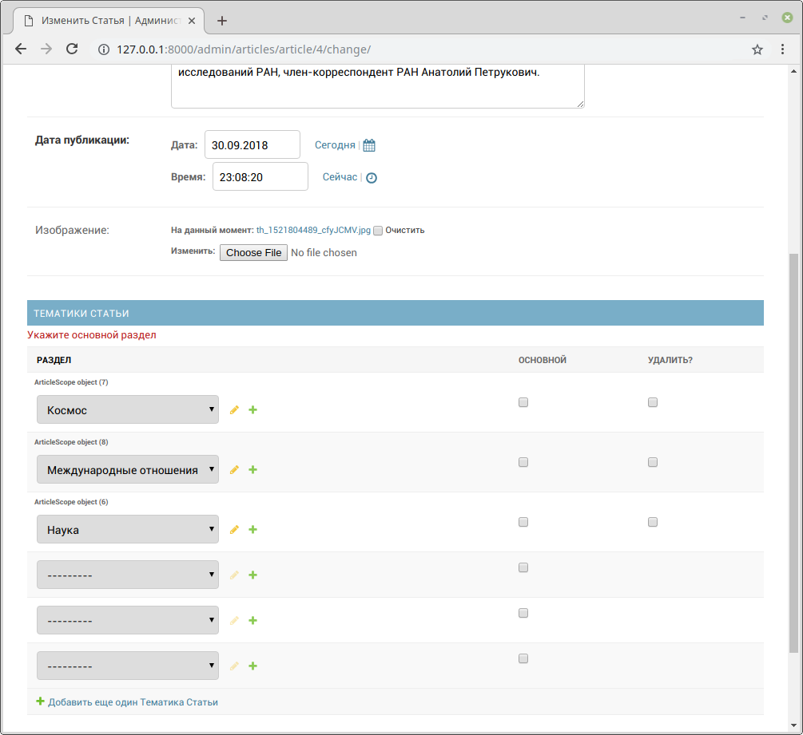

# Кастомизация отображения списка моделей в Django Admin

## Описание

Данный проект демонстрирует, как настроить отображение списка объектов моделей в административной панели Django. Он иллюстрирует использование атрибутов `list_display`, `list_filter` и `search_fields` для улучшения интерфейса администратора, позволяя более эффективно управлять данными.

## Технические данные

- **Язык программирования:** Python 3.x
- **Веб-фреймворк:** Django 3.x или выше
- **База данных:** SQLite (по умолчанию)

## Установка и запуск

1. **Создание и активация виртуального окружения**

   Рекомендуется использовать виртуальное окружение для изоляции проекта:

   ```bash
   python3 -m venv venv
   source venv/bin/activate
   ```

2. **Установка зависимостей**

   Установите необходимые зависимости, указанные в файле `requirements.txt`:

   ```bash
   pip install -r requirements.txt
   ```

4. **Применение миграций базы данных**

   Выполните миграции для настройки базы данных:

   ```bash
   python manage.py migrate
   ```

5. **Создание суперпользователя**

   Для доступа к административной панели создайте суперпользователя:

   ```bash
   python manage.py createsuperuser
   ```

   Следуйте инструкциям на экране для установки имени пользователя и пароля.

6. **Загрузка тестовых данных**

    ```bash
    python manage.py loaddata articles.json
    ```

7. **Запуск сервера разработки**

   Запустите сервер разработки Django:

   ```bash
   python manage.py runserver
   ```

8. **Доступ к административной панели**

   Откройте веб-браузер и перейдите по адресу `http://127.0.0.1:8000/admin/`. Войдите, используя учетные данные суперпользователя, созданного ранее.

8. **Проверка кастомизации**

   В административной панели выберите одну из моделей. Вы увидите, что список объектов настроен с дополнительными колонками, фильтрами и возможностью поиска, что упрощает управление данными.

## Скриншоты
### Главная страница
   
### Главная страница с разделами
   
### Настройка разделов в админ панели
   

## Заключение

Этот проект служит примером того, как можно улучшить интерфейс административной панели Django, делая его более удобным и функциональным для работы с моделями и их данными.


